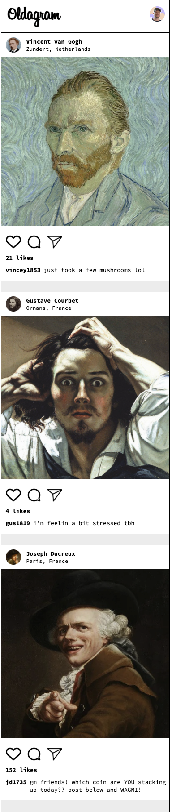

# Instagram Clone (Oldagram)

A simple Instagram-inspired social feed built with HTML, CSS, and JavaScript. Users can view posts, interact with post actions, and like or unlike posts in real time.

## Live Demo

https://shwarzbergzelda.github.io/Instagram-Clone/

## Preview



## Features

- Display multiple social media posts
- Like and unlike posts
- Dynamic like count updates
- Hover effects on interaction icons
- Responsive post layout
- Profile information and captions for each post
- Data-driven rendering using JavaScript

## Built With

- HTML5
- CSS3
- JavaScript (ES6)

## What I Learned

Through this project, I practiced:

- Rendering data dynamically with JavaScript
- Using `map()` to generate HTML
- Event delegation
- DOM manipulation
- Working with arrays and objects
- Updating UI based on application state
- Creating interactive user experiences
- Building responsive layouts with Flexbox

## Features Implemented

### Post Rendering
Posts are generated dynamically from a JavaScript data file rather than being hardcoded in HTML.

### Like System
Users can:
- Like a post
- Unlike a post
- See the like count update instantly

### Interactive UI
- Hover effects on action icons
- Visual feedback for liked posts
- Instagram-inspired layout and styling

## Future Improvements

- Add comments functionality
- Persist likes using local storage
- Add animations for likes
- Double-click image to like
- Add dark mode
- Connect to a backend API

## Project Structure

```text
Instagram-Clone/
├── images/
│   ├── homepage-screenshot.png
│   ├── avatar-*.jpg
│   ├── icon-heart.png
│   ├── icon-comment.png
│   └── icon-dm.png
├── data.js
├── index.html
├── index.css
├── index.js
└── README.md
```

## Author

**Zelda Shwarzberg**

GitHub: https://github.com/shwarzbergzelda
